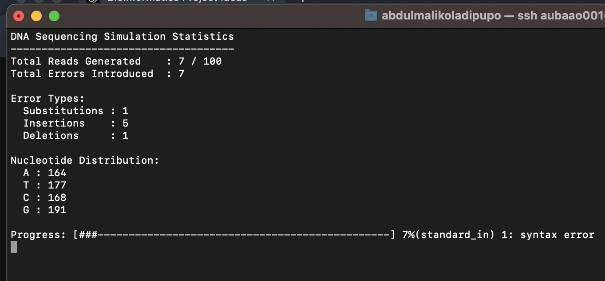
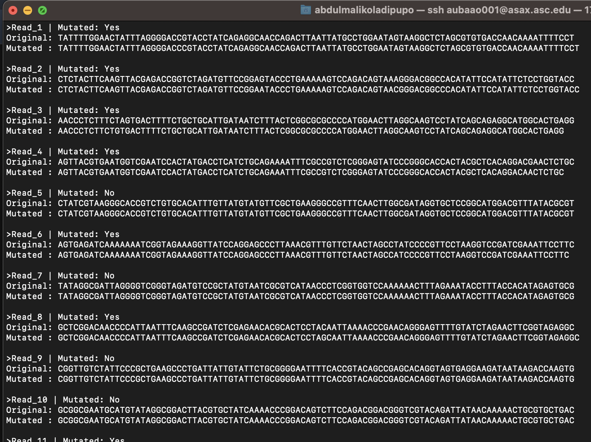

# Oladipupo_Assignment_16 (Comp_Biology)

## Background
### Justifications
  * Simulating DNA sequencing reads is a common practice in bioinformatics to test algorithms, pipelines, and analytical methods without using real sequencing data
  * It helps understand how sequencing errors and mutations can affect downstream analyses like alignment, assembly, taxonomy assignment, and variant calling.
  * Due to technological limitations, real sequencing data often contain errors. Simulating these errors is crucial for developing error correction algorithms and assessing their effectiveness.

### Why?
 * Most bioinformatics simulations and visualizations rely on specialized software or programming languages like Python or R. Using Bash exclusively is unconventional and challenges you to leverage core UNIX tools creatively.

### Objective
 * Write a script that simulates reads with controlled errors
 * This script could be integrated for use in developing algorithms for error correction
 * Produce a controlled reads to test the functionality of any pipeline

### Add-Ins
 * Real-time Statistics and Visualization
 * This real-time monitoring could allow bioinformaticians to assess data quality and make immediate decisions during data processing


## The Script
* Written with Nano on ASC HPC machine
> A **_shebang_** line for shell script. This line specifies that the script should be run using the Bash shell.  
>```ruby
>#! /bin/bash
>```
_______________________________________________________

* Simulation Parameters and Output File Initialization
> * Define variables for the number of reads and length
> 
>```ruby
># Number of reads to simulate
>NUM_READS=100
># Length of each read
>READ_LENGTH=100
># Error rate (probability of error at each nucleotide)
>ERROR_RATE=0.01  # 1% error rate
># Output file for mutated reads
>OUTPUT_FILE="mutated_reads.fasta"
> "$OUTPUT_FILE"  # Truncate the file if it exists
>```
_________________________________________________________

* Statistical Counters Initialization
>  * Generates a random DNA sequence of a specified length
>   * Loops length times, randomly selecting a nucleotide each time and appending it to seq
>     
>```ruby
>generate_read() {
>local length=$1 #The length of the sequence.
>local seq="" #The sequence being built.
>
>local nucleotides=("A" "T" "C" "G") 
>for (( i=0; i<length; i++ )); do
>rand_index=$(( RANDOM % 4 ))
>seq+=${nucleotides[$rand_index]} 
>done
>
>echo "$seq"
>}
>```
______________________________________________________________

* Function: introduce_errors
> * <u>Purpose:</u> Introduces sequencing errors into a given DNA sequence.
> * Parameters: The original DNA sequence ($1).
> * Variables: **_Mutated_seq_**, **_error_count_**, **_seq_length_**, **_Nucleotides_**
> * Logic: Iterates over each nucleotide in the sequence.
> * Type of Error: SUBSTITUTION, DELETION, INSERTION, DELETION
> * Randomly selects the type of error (substitution, insertion, deletion)
>   
>```ruby
>introduce_errors() {
  >local seq="$1"
  >mutated_seq=""          # Global variable
  >error_count=0           # Global variable
  >local seq_length=${#seq}
  >local nucleotides=("A" "T" "C" "G")
  >
  >for (( i=0; i<seq_length; i++ )); do
  >nucleotide=${seq:$i:1}
  >
  > # Update nucleotide counts
  >  case "$nucleotide" in
  >    A) COUNT_A=$((COUNT_A + 1)) ;;
  >    T) COUNT_T=$((COUNT_T + 1)) ;;
  >    C) COUNT_C=$((COUNT_C + 1)) ;;
  >    G) COUNT_G=$((COUNT_G + 1)) ;;
  >  esac
  >
  >   # Generate a random floating-point number between 0 and 1
  >  rand_float=$(awk -v seed="$RANDOM" 'BEGIN { srand(seed); print rand() }')
  >  if (( $(echo "$rand_float < $ERROR_RATE" | bc -l) )); then
  >   error_count=$((error_count + 1))
  >    # Decide the type of error: substitution, insertion, or deletion
  >    error_type=$(( RANDOM % 3 ))
  >   case $error_type in
  >    0)  # Substitution
  >         SUBSTITUTIONS=$((SUBSTITUTIONS + 1))
  >        # Replace nucleotide with a different one
  >           alt_nucleotides=("${nucleotides[@]/$nucleotide}")
  >           new_nuc=${alt_nucleotides[$(( RANDOM % 3 ))]}
  >           mutated_seq+="$new_nuc"
  >          ;;
  >     1)  # Insertion
  >        INSERTIONS=$((INSERTIONS + 1))
  >         # Insert a random nucleotide before the current one
  >         new_nuc=${nucleotides[$(( RANDOM % 4 ))]}
  >         mutated_seq+="$new_nuc$nucleotide"
  >         ;;
  >     2)  # Deletion
  >         DELETIONS=$((DELETIONS + 1))
  >         # Skip adding the current nucleotide (deletion)
  >         continue
  >        ;;
  >    esac
  > else
  >  mutated_seq+="$nucleotide"
  > fi
  > done
  > No need to echo output; mutated_seq and error_count are global variables
  > }
>```
__________________________________________________________________

* Function: display_statistics
> *  Displays real-time simulation statistics in the terminal.
> *  Prints total reads generated, mutated reads, total errors, error types, and nucleotide counts.
> *  Calculates the progress percentage. Constructs a visual progress bar using # and - characters.
>   
>```ruby
> display_statistics() {
># Clear the screen
>  tput clear
>
>  # Move cursor to top-left corner
>  tput cup 0 0
>
>  echo "DNA Sequencing Simulation Statistics"
>  echo "------------------------------------"
>  echo "Total Reads Generated    : $TOTAL_READS / $NUM_READS"
>  echo "Total Mutated Reads      : $MUTATED_READS / $TOTAL_READS"
>  echo "Total Errors Introduced  : $TOTAL_ERRORS"
>  echo ""
>  echo "Error Types:"
>  echo "  Substitutions : $SUBSTITUTIONS"
>  echo "  Insertions    : $INSERTIONS"
>  echo "  Deletions     : $DELETIONS"
>  echo ""
>  echo "Nucleotide Distribution:"
>  echo "  A : $COUNT_A"
>  echo "  T : $COUNT_T"
>  echo "  C : $COUNT_C"
>  echo "  G : $COUNT_G"
>  echo ""
>  # Progress bar
>  progress=$(( TOTAL_READS * 100 / NUM_READS ))
>  bar_width=50
>  filled=$(( progress * bar_width / 100 ))
>  unfilled=$(( bar_width - filled ))
>  bar=$(printf "%0.s#" $(seq 1 $filled))
>  spaces=$(printf "%0.s-" $(seq 1 $unfilled))
>  echo -ne "Progress: [${bar}${spaces}] $progress%"
>
> # Sleep for a brief moment to allow display update
>  sleep 0.1
> }
>```
_____________________________________________________________________

* Terminal Settings and Trap
> * Ensures that the terminal returns to its normal state after the script finishes or is interrupted.
>   
>```ruby
> # Save the current terminal settings and clear the screen
>tput smcup
>trap "tput rmcup; exit" EXIT
>```
_________________________________________________________________

* Main Loop: Simulating Reads
> * Simulates the specified number of reads, introduces errors, updates counters, and displays statistics.
> * Check for Mutations and Compare read_seq and mutated_seq.
> * If they are different, sets is_mutated to "Yes" and increments MUTATED_READS.
> * Otherwise, sets is_mutated to "No."
> * Appends the read information to OUTPUT_FILE, including whether it was mutated, the original sequence, and the mutated sequence
>    
>```ruby
> # Simulate reads with errors
>for (( n=1; n<=NUM_READS; n++ )); do
>  read_seq=$(generate_read "$READ_LENGTH")
>  introduce_errors "$read_seq"
>  TOTAL_ERRORS=$(( TOTAL_ERRORS + error_count ))
>  TOTAL_READS=$(( TOTAL_READS + 1 ))
>
>  # Check if the read was mutated
>  if [ "$read_seq" != "$mutated_seq" ]; then
>    is_mutated="Yes"
>    MUTATED_READS=$((MUTATED_READS + 1))
>  else
>    is_mutated="No"
>  fi
>
>  # Write original and mutated reads to the output file
>  echo ">Read_$n | Mutated: $is_mutated" >> "$OUTPUT_FILE"
>  echo "Original: $read_seq" >> "$OUTPUT_FILE"
>  echo "Mutated : $mutated_seq" >> "$OUTPUT_FILE"
>  echo "" >> "$OUTPUT_FILE"  # Add an empty line for readability
>
> # Display statistics in real-time
>  display_statistics
>done
>```
____________________________________________________

* Terminal Restoration and Completion Message
>```ruby
># Restore the terminal settings when done
>tput rmcup
>
>echo -e "\n\nSimulation complete. Mutated reads saved to '$OUTPUT_FILE'."
>```
___________________________________________________

## Sample Output
Real-time data generation
>```ruby
>
>```



Output file/Log file

______________________________________________________

## AI Contribution
> * I used AI to refine the idea of the script
> * AI was used to improve the main loop script for iterating and comparing seq and mutated_seq
> * AI gave me the option of running the script analysis in real time on the terminal and ensuring the terminal is cleared.
> * With AI, the script improved for integration into an existing pipeline 
______________________________________________________

## Application
> * Create datasets with known error profiles to train machine learning models for error correction.
> * Provide simulated reads to assembly software like SPAdes or Velvet and analyze the assembly results.
> * Use the synthetic data to test how well quality control tools detect and report errors.
> * Use the script in workshops or courses to allow students to experiment with different error rates and observe the effects.
_______________________________________________________

## Possible development
> * Record the positions and types of mutations introduced, which will be useful for the error correction tool
> * Optimize the script to handle the generation of millions of reads efficiently.
> * Incorporate error models that reflect the biases and patterns of specific sequencing technologies.
> * Include quality scores to simulate real sequencing data more accurately, especially for a pipeline that requires a FASTQ input


